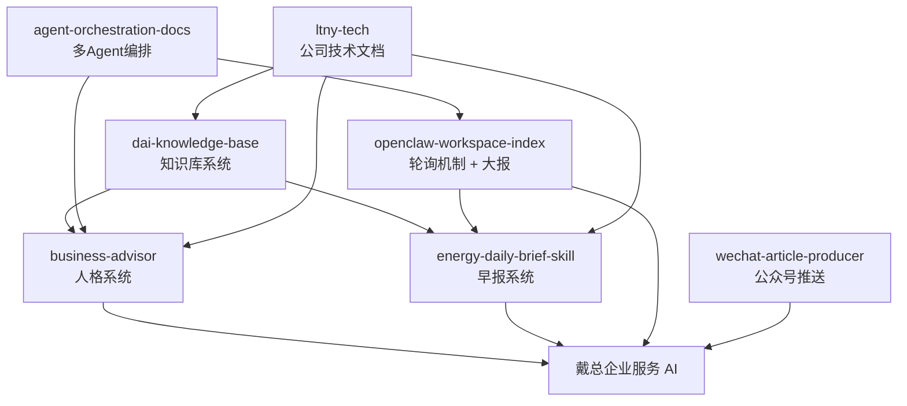

# 三大核心仓库定位

## 结论

基于《我的ai 知识库--唐泽龙的AI 时代的重要资产》以及 7 个候选仓库的 README，对戴总业务最核心的 3 个仓库是：

1. `dai-knowledge-base`
2. `energy-daily-brief-skill`
3. `business-advisor`

这 3 个仓库分别对应：**知识库系统、早报系统、人格系统**。它们共同构成戴总企业服务 AI 的最小闭环：

- `知识库系统` 提供行业知识与检索底座
- `早报系统` 提供高频触达与日常业务输出
- `人格系统` 提供面向老板的表达方式与决策支持能力

## 逐个判断

### 1. dai-knowledge-base

- 一句话定位：戴总企业服务 AI 的行业知识底座，负责沉淀电力行业结构化知识与检索体系。
- 对应系统：知识库系统
- 使用场景：当 AI 需要查询电力行业标准、发输变配用知识、政策分类、历史资料沉淀时调用。

### 2. energy-daily-brief-skill

- 一句话定位：面向戴总的能源行业日报引擎，负责每日采集、筛选、生成并推送早报。
- 对应系统：早报系统
- 使用场景：每天固定时间自动抓取政策与行业资讯，形成 6 大板块早报并推送到企业微信/飞书。

### 3. business-advisor

- 一句话定位：把 AI 训练成“懂经营、懂情绪、懂行业”的老板顾问，负责人格与决策表达。
- 对应系统：人格系统
- 使用场景：当戴总询问战略、团队、投资、转型、情绪压力、经营判断时，给出符合老板语境的高质量回复。

## 为什么不是另外 4 个

### openclaw-workspace-index

- 定位：轮询机制 + 大报 + 工作目录索引
- 判断：重要，但属于**调度和运维层**，不是业务最核心的主系统。

### agent-orchestration-docs

- 定位：多 Agent 编排方法论与协作文档
- 判断：重要，但属于**编排与方法层**，不是戴总业务直接感知的主系统。

### ltny-tech

- 定位：公司技术文档与知识归档主仓
- 判断：重要，但更偏**公司资料与总文档中台**，不是最核心的 AI 产品系统。

### wechat-article-producer

- 定位：公众号文章生成与推送自动化
- 判断：重要，但属于**内容分发渠道**，优先级低于知识库、早报、人格三大主系统。

## 仓库关系图

## 最终判断

如果只保留 3 个最核心仓库，它们应该是：

1. `dai-knowledge-base`：决定 AI 知道什么
2. `business-advisor`：决定 AI 怎么说
3. `energy-daily-brief-skill`：决定 AI 每天输出什么

三者合起来，正好对应一套完整业务闭环：

**知道什么 -> 怎么表达 -> 如何高频输出**

## 依据来源

- 知识库总文档：
  - https://raw.githubusercontent.com/tang730125633/ltny-tech/main/%E6%88%91%E7%9A%84ai%20%E7%9F%A5%E8%AF%86%E5%BA%93--%E5%94%90%E6%B3%BD%E9%BE%99%E7%9A%84AI%20%E6%97%B6%E4%BB%A3%E7%9A%84%E9%87%8D%E8%A6%81%E8%B5%84%E4%BA%A7.md
- energy-daily-brief-skill README：
  - https://raw.githubusercontent.com/tang730125633/energy-daily-brief-skill/main/README.md
- business-advisor README：
  - https://raw.githubusercontent.com/tang730125633/business-advisor/main/README.md
- openclaw-workspace-index README：
  - https://raw.githubusercontent.com/tang730125633/openclaw-workspace-index/main/README.md
- agent-orchestration-docs README：
  - https://raw.githubusercontent.com/tang730125633/agent-orchestration-docs/main/README.md
- ltny-tech README：
  - https://raw.githubusercontent.com/tang730125633/ltny-tech/main/README.md
- wechat-article-producer README：
  - https://raw.githubusercontent.com/tang730125633/wechat-article-producer/main/README.md

> 备注：`dai-knowledge-base` 的 raw README 路径当前返回 404，因此该仓库定位以知识库总文档中的主表说明为准。
